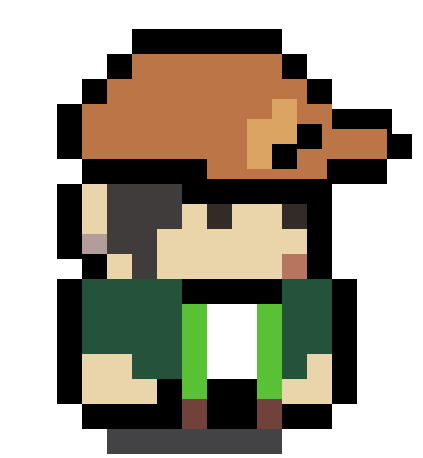
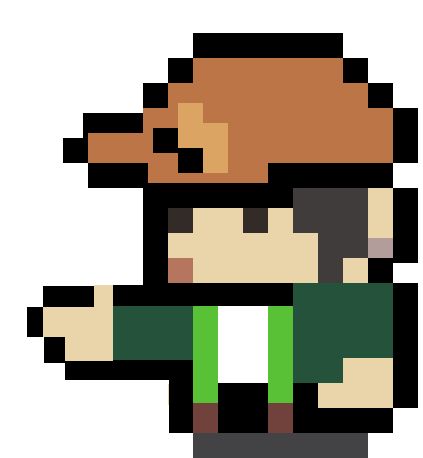

  
  

<table>
  
<tr><td>

###  About Me 

&emsp;&emsp;你好，我是Tsunami-lin。热爱编程、读书、音乐、绘画

&emsp;&emsp;我致力创造一个承载我灵魂的游戏【持续发力中】

&emsp;&emsp;我会放下所有遗憾，清空所有不快，用代码守护此刻的美好

&emsp;&emsp;<strong>I leave behind all sorrows, clear away all unease, and guard the beauty of now with code.&emsp;&emsp;&emsp;&emsp;&emsp;&emsp;&emsp;&emsp;&emsp;&emsp;&emsp;&emsp;&emsp;&emsp;</strong>

</td></tr>

</table>
